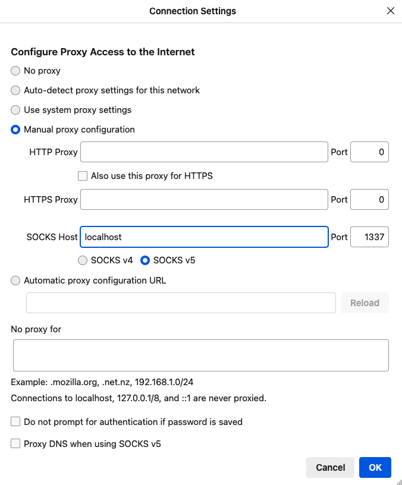

# SocksBox
Terraform template that creates a truly ephemeral socks proxy in AWS.

## Usage
Clone this repo.

Authenticate with AWS (provide sufficient permissions to deploy the required resources)

Run terraform init:
```shell
terraform init
```
Run terraform apply:
```shell
terraform apply
```
Initiate tunnel by running starttunnel.sh
```shell
./tunnel.sh
```

When done, run terraform destroy:
```shell
terraform destroy
```

## Notes

The tunnel has to be set up manually as terraform kills all processes it spawned after running apply.
I have provided `tunnel.sh` to do the work for you.

The tunnel will be killed for you automatically when terraform destroy is run.

## Browser setup
Here is an example in Firefox...


## Testing
In your browser go to something like http://icanhazip.com/
The ip should be the same as the `socksbox_ip` output.